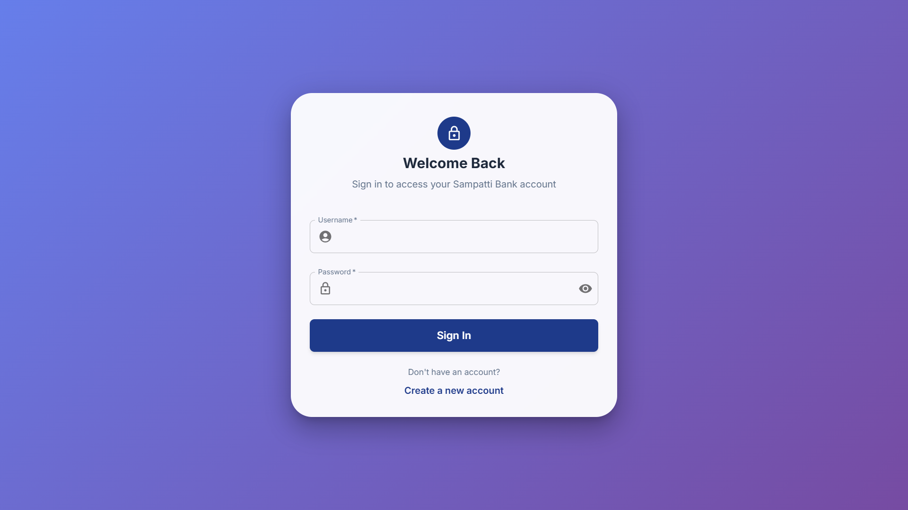
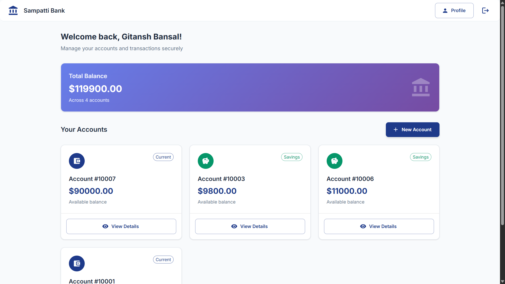
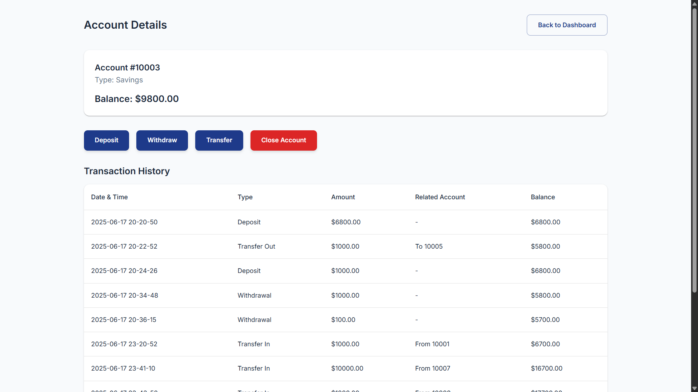
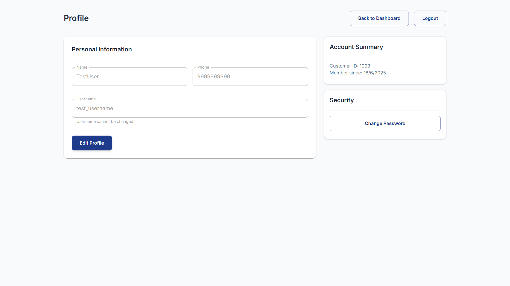
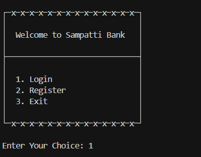
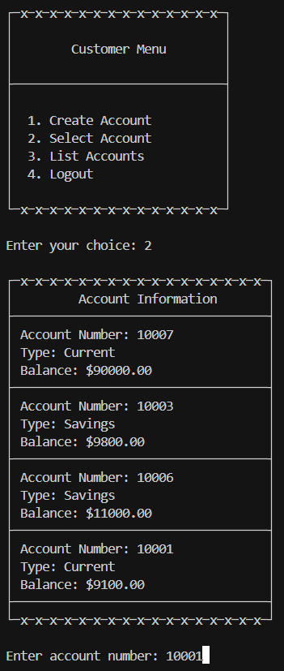
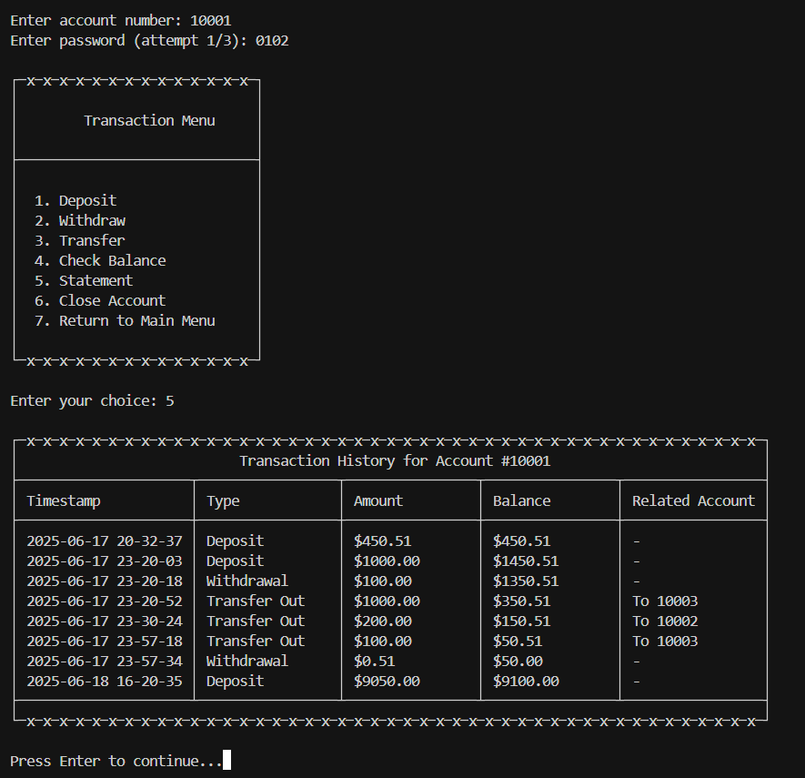
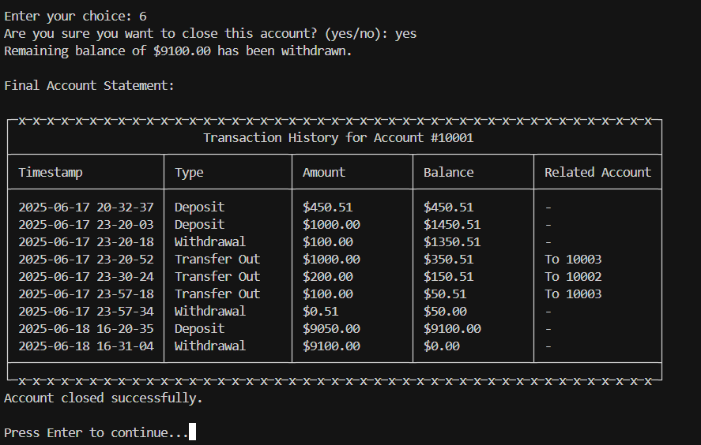

# Sampatti Bank - Bank Management System

**Live Website:** [https://bank-management-system-vert.vercel.app/](https://bank-management-system-vert.vercel.app/)

**API Endpoint:** [https://bank-management-system-si7g.onrender.com/](https://bank-management-system-si7g.onrender.com/)

A comprehensive C++ project demonstrating all fundamental Object-Oriented Programming (OOP) principles through a fully functional bank management system. The system provides both a console interface and a modern web interface.

---

## Features

- **Customer Registration & Login**
  - Secure registration with username, password, and phone validation.
  - Login with authentication and password protection.

- **Account Management**
  - Multiple account types: Savings, Current, Auditable Savings.
  - Create, select, and list accounts for each customer.
  - Password-protected accounts.

- **Transactions**
  - Deposit, Withdraw, and Transfer funds between accounts.
  - Transaction history and account statements.
  - Auditable accounts with detailed logs.

- **Account Closure**
  - Close accounts with options to withdraw or transfer remaining balance.
  - Final statement generation.

- **Persistence**
  - All data (customers, accounts, transactions) is saved and loaded from files.
  - Data directory structure for easy management.

- **Dual Interface**
  - **Console Application**: Interactive command-line interface
  - **Web Application**: Modern React-based web interface with REST API

---

## Screenshots

### Web Application

#### Login Page


#### Dashboard


#### Account Details


#### Profile Management


### Console Application

#### Main Menu


#### Customer Menu


#### Transaction Menu


#### Account Closure


---

## OOP Principles Demonstrated

- **Encapsulation:**  
  All data members are private/protected. Access is provided via public methods. Validation is enforced in constructors and setters.

- **Abstraction:**  
  Abstract base classes (`Account`, `ITransaction`) define interfaces for accounts and transactions. Concrete classes implement specific behaviors.

- **Inheritance:**  
  - `SavingsAccount`, `CurrentAccount`, and `AuditableSavingsAccount` inherit from `Account`.
  - `Deposit`, `Withdrawal`, and `Transfer` inherit from `ITransaction`.

- **Polymorphism:**  
  - Transactions are handled via pointers/references to `ITransaction`.
  - Account operations use virtual and pure virtual methods for deposit, withdraw, and interest calculation.

- **Virtual Methods & Pure Virtual Methods:**  
  - The `Account` and `ITransaction` classes declare virtual and pure virtual methods, enabling runtime polymorphism and enforcing interface contracts for derived classes.

- **Composition:**  
  - `Customer` contains a list of `Account` objects.
  - `Account` can contain a list of `ITransaction` objects (transaction history).

- **Singleton Pattern:**  
  - `Database` and `BankApp` are implemented as singletons to ensure a single point of access.

---

## Project Structure

```
Bank-Management-System/
├── include/                           # Header files (class definitions)
├── src/                               # Source files (class implementations)
├── data/                              # Data persistence (created at runtime)
├── bin/                               # Compiled executables
├── obj/                               # Object files
├── api/                               # Web API server (Node.js/Express)
│   ├── server.js                      # REST API server
│   └── package.json                   # Node.js dependencies
├── frontend/                          # React web application (Vite + TypeScript)
│   ├── src/                           # React source code
│   │   ├── pages/                     # React page components
│   │   ├── contexts/                  # React context providers
│   │   ├── App.tsx                    # Main application component
│   │   └── main.tsx                   # Application entry point
│   ├── index.html                     # HTML template
│   ├── vite.config.ts                 # Vite configuration
│   └── package.json                   # React dependencies
├── Makefile                           # Build instructions
├── .gitignore                         # Git ignore rules
└── README.md                          # Project documentation
```

---

## How to Build & Run

### Console Application

1. **Build the project:**
   ```sh
   make clean
   make
   ```

2. **Run the console application:**
   ```sh
   make run
   # OR
   ./bin/bank
   ```

**Command-line API mode (For Debugging):**
   ```sh
   # Register a customer
   ./bin/bank register "John Doe" "1234567890" "john_doe" "Password123"
   
   # Login
   ./bin/bank login "john_doe" "Password123"
   
   # Create account
   ./bin/bank create-account "john_doe" "Password123" "savings" 1000.00
   
   # Deposit
   ./bin/bank deposit 10001 500.00 "Password123"
   
   # Withdraw
   ./bin/bank withdraw 10001 200.00 "Password123"
   
   # Transfer
   ./bin/bank transfer 10001 10002 100.00 "Password123"

   # View account details
    ./bin/bank account-details 10001 "Password123"

   # View transaction history
    ./bin/bank transaction-history 10001 "Password123"

   # Close account
    ./bin/bank close-account 10001 "Password123"
   ```

### Web Application

1. **Install Node.js dependencies:**
   ```sh
   cd api
   npm install
   
   cd ../frontend
   npm install
   ```

2. **Start the API server:**
   ```sh
   cd api
   npm start
   # Server runs on http://localhost:3001
   ```

3. **Start the React frontend:**
   ```sh
   cd frontend
   npm run dev
   # Frontend runs on http://localhost:5173
   ```

4. **Access the web application:**
   - Open your browser and go to `http://localhost:5173`
   - Register a new account or login with existing credentials
   - Use the modern web interface to manage your accounts

---

## API Endpoints

The web application uses a REST API with the following endpoints:

- `POST /api/auth/register` - Register new customer
- `POST /api/auth/login` - Customer login
- `GET /api/accounts` - Get customer accounts
- `POST /api/accounts` - Create new account
- `POST /api/accounts/:id/deposit` - Deposit funds
- `POST /api/accounts/:id/withdraw` - Withdraw funds
- `POST /api/accounts/:id/transfer` - Transfer funds
- `GET /api/accounts/:id/transactions` - Get transaction history
- `PUT /api/profile` - Update customer profile
- `PUT /api/password` - Change password

---

## Main Classes & Responsibilities

- **BankApp:**  
  Main application controller. Handles menus, user input, and high-level flow. Provides API methods for web interface.

- **Database:**  
  Singleton. Manages all customers, accounts, authentication, and file persistence.

- **Customer:**  
  Represents a bank customer. Manages their accounts.

- **Account (Abstract):**  
  Base class for all account types. Defines interface for deposit, withdraw, and interest.

- **SavingsAccount, CurrentAccount, AuditableSavingsAccount:**  
  Concrete account types with specific rules and features.

- **ITransaction (Interface):**  
  Abstract base for all transactions (deposit, withdrawal, transfer).

- **Deposit, Withdrawal, Transfer:**  
  Concrete transaction types implementing `ITransaction`.

---

## Technologies Used

- **Backend:** C++17 with Object-Oriented Design
- **Web API:** Node.js with Express.js
- **Frontend:** React with TypeScript
- **Build System:** Make (C++), npm (Node.js)
- **Data Storage:** File-based persistence (JSON-like format)

---

## Utilities & Validation

- Input validation for all user data (names, phone numbers, usernames, passwords).
- Password protection for both customer and account access.
- Safe input handling to prevent invalid or malicious entries.
- Cross-platform compatibility (Windows, macOS, Linux).
- UTF-8 support for proper character display.

---

## Development Notes

- The C++ backend serves both console and web interfaces
- Data is shared between console and web applications
- The web API spawns the C++ executable for backend operations
- All data is persisted in the `data/` directory
- Build artifacts are stored in `obj/` and `bin/` directories

---

## Contributors

- Gitansh Bansal
- Shaurya Anant

---

## Production Deployment (Render + Vercel)

### Backend (API) Deployment on Render
1. **Push your code to GitHub** with the full project structure.
2. **Create a new Web Service on [Render](https://render.com/):**
   - Connect your GitHub repo.
   - Set the root directory to `Bank-Management-System/api`.
   - Set the build command to:
     ```sh
     npm install && npm run build:cpp
     ```
   - (If you see errors about `g++` missing, use: `apt-get update && apt-get install -y build-essential && npm install && npm run build:cpp`)
   - Set the start command to:
     ```sh
     npm start
     ```
   - Deploy and note your backend URL (e.g., `https://your-app.onrender.com`).

### Frontend Deployment on Vercel
1. **Create a new project on [Vercel](https://vercel.com/)** and link your GitHub repo.
2. **Set the environment variable:**
   - `VITE_API_URL=https://your-app.onrender.com` (replace with your actual backend URL)
   - Set this in the Vercel dashboard under Project Settings → Environment Variables.
3. **Deploy the frontend.**
4. **Routing fix:** Add a `vercel.json` file to the `frontend/` directory:
   ```json
   {
     "rewrites": [
       { "source": "/(.*)", "destination": "/" }
     ]
   }
   ```
   This ensures client-side routing works for all URLs.

---

## Environment Variables
- **Frontend:** Set `VITE_API_URL` to your backend's public URL in Vercel.
- **Backend:** No special environment variables required unless you add a database or secrets.

---

## Data Storage Note
- **All data is stored in the `data/` directory on the backend server.**
- On Render (and most cloud hosts), this storage is **ephemeral**: data will be lost on redeploys, restarts, or scaling events.
- For persistent storage, use a managed database and update the C++ code to use it.

---

## .gitignore
- The repository includes a `.gitignore` to exclude:
  - `node_modules/`, build artifacts, and binaries
  - `data/` directory (runtime data)
  - `.env` files (environment variables)
  - OS and log files
- This keeps your repository clean and secure.

---
